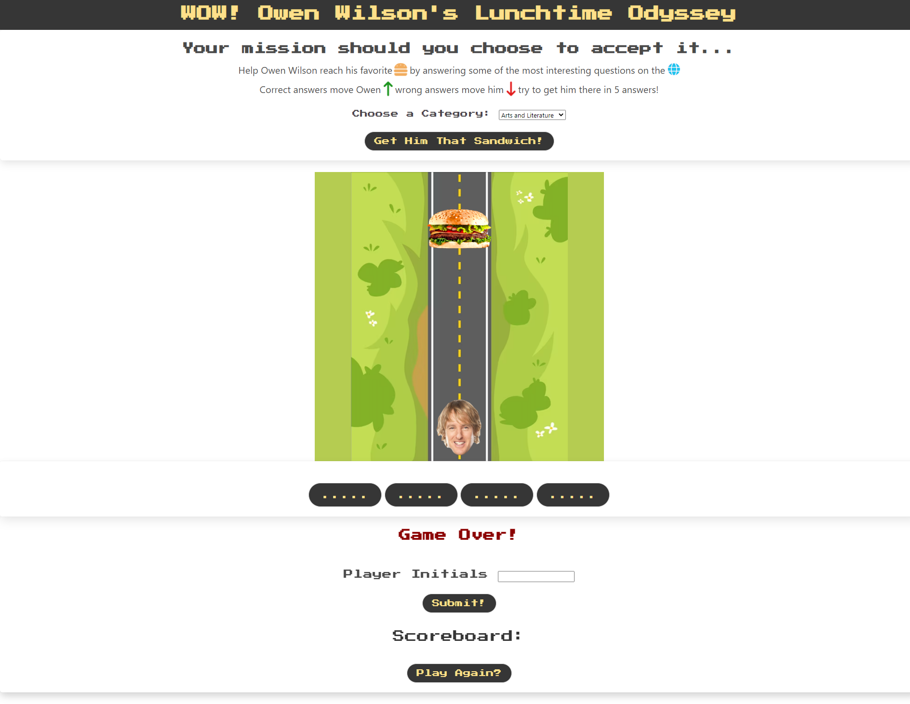

# Wow-The-Lunchtime-Odyssey

## Description

This is the 1st project of team Elva Rothman, Melanie Sapiandante, and Andrew Dean for Penn Full Stack Web Development. Wow! Owen Wilson's Lunchtime Odyssey is a game adventure tied to some of the most interesting trivia on the internet. Get owen to his sandwich and have a blast! 

## Installation

N/A

## Usage

To navigate the Odyssey, the user can click/select the game category and begin the game. for each correct trivia question answered Owen moves up, closer to his prize, eachquestion you get wrong he moves back. Aim for the lowest score of 5!

[Program]()
## Credits
We utilized the  [owen wilson API] (https://owen-wilson-wow-api.onrender.com/) for this project.
We utilized the  [trivia API] (https://the-trivia-api.com/docs/#getQuiz) for this project.
We utilized [Font awesome] (https://fontawesome.com/search?q=sandwich&o=r&m=free) for this project.
We utilized [ Bulma ] (https://bulma.io/) for this project.
 W3 Schools
 
 Leif and Fred

## License

N/A